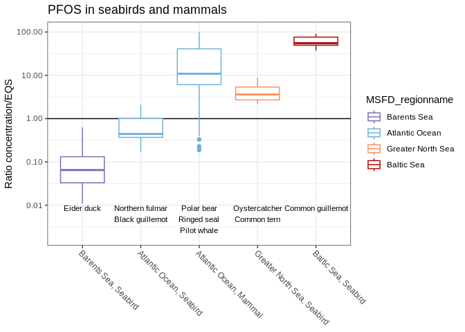

+


## 1. Packages    

```r
library(dplyr)
library(purrr)
library(lubridate)
library(readr)
library(stringr)    
library(ggplot2)
library(ggeasy)        # easy formatting of ggplot plots
library(forcats)       # easy ordering of levels in a factor
library(RColorBrewer)  
library(glue)

library(agricolae)
```

## 2. Read ICES data

*  No PFAS in EMODnet data   


### ICES data


```r
# As EMODnet, only that L20 and botDepth 
coltypes <- cols(
  .default = col_character(),
  MYEAR = col_integer(),
  SD_StationCode = col_double(),
  Samplingtime = col_date(format = ""),
  Latitude = col_double(),
  Longitude = col_double(),
  DEPHU = col_double(),
  DEPHL = col_double(),
  SampleIdentifier = col_character(),
  SubsampleIdentifier = col_character(),
  WoRMS_AphiaID = col_character(),
  WoRMS_accepted_AphiaID = col_character(),
  SEXCO = col_character(),
  Value = col_double(),
  # L20 = col_double(),
  UNCRT = col_double(),
  LMQNT = col_double(),
  DETLI = col_double(),
  DRYWT = col_double(),
  FATWT = col_double(),
  EXLIP = col_double(),
  LIPIDWT = col_double()
  # BotDepth = col_double()
)

df2_orig <- readr::read_tsv("Input_data/From_Hans_2023/ICES_DOME_biota_20230601_1.txt", col_types = coltypes) %>%
  mutate(Year = year(Samplingtime), 
         Month = month(Samplingtime), 
         .before = everything())

nrow(df2_orig)
```

```
## [1] 1635146
```

```r
# 1635146
```


## 3. Define lookup terms  

### Define species type and common name  

* ICES data  


```r
# For writing code:
# df2_orig %>%
#   filter(PARAM == "PFOS") %>% pull(WoRMS_scientificName) %>% unique() %>% dput

df_taxon <- tribble(
  ~WoRMS_scientificName, ~Species_type, ~Common_name,
  "Clupea harengus", "Fish, low-trophic", "Herring", 
  "Uria aalge", "Seabird", "Common guillemot", 
  "Platichthys flesus", "Fish, benthic", "European flounder",
  "Pleuronectes platessa", "Fish, benthic", "European plaice", 
  "Crassostrea gigas", "Mussel/oyster", "Pacific oyster",
  "Mytilus edulis", "Mussel/oyster", "Blue mussel",
  "Gadus morhua", "Fish, predatory", "Cod",
  "Perca fluviatilis", "Fish, predatory", "European perch",
  "Haematopus ostralegus", "Seabird", "Oystercatcher",
  "Sterna hirundo", "Seabird", "Common tern",
  "Macoma balthica", "Mussel/oyster", "Baltic macoma",
  "Zoarces viviparus", "Fish, low-trophic", "Eelpout", 
  "Neogobius melanostomus", "Fish, benthic", "Round goby", 
  "Somateria mollissima", "Seabird", "Eider duck",
  "Ursus maritimus", "Mammal", "Ice bear", 
  "Phoca hispida", "Mammal", "Ringed seal", 
  "Globicephala melas", "Mammal", "Pilot whale", 
  "Ovis aries", "Terrestrial mammal", "Sheep",
  "Abramis brama", "Fish, low-trophic", "Bream", 
  "Fulmarus glacialis", "Seabird", "Northern fulmar",
  "Cepphus grylle", "Seabird", "Black guillemot"
)
```

### Define region names   


```r
if (FALSE){
  ggplot(df2_orig %>% distinct(Longitude, Latitude, MSFD_region), 
         aes(Longitude, Latitude, color = MSFD_region)) +
    geom_point()
}


df_region <- tribble(
  ~MSFD_region, ~MSFD_regionname,
  "ABI", "Biscay, Iberian coast",
  "ACS", "Celtic Seas",
  "ANS", "Greater North Sea",
  "ATL", "Atlantic Ocean",
  "BAL", "Baltic Sea",
  "BAR", "Barents Sea",
  "NOR", "Norwegian Sea"
)
```


### Add species type and common names + region  


```r
df2_orig2 <- df2_orig %>%
  left_join(df_taxon, by = "WoRMS_scientificName") %>%
  left_join(df_region, by = "MSFD_region")
```

## 4. Tables  

### Number of measurements   

* ICES only, as there are no EMODnet data   


```r
df2_orig2 %>%
  filter(PARGROUP == "O-FL") %>%
  xtabs(~ MYEAR + PARAM, .)
```

```
##       PARAM
## MYEAR  br-PFHXS br-PFOS n-PFHXS n-PFOS PFBS PFDA PFHpA PFHxA PFHXS PFNA PFOA
##   2001        0       0       0      0    1    1     1     1     1    0    1
##   2002        0       0       0      0    1    3     3     1     3    0    3
##   2003        0       0       0      0    0   18     0     0    10   19   19
##   2005        0       0       0      0   57    0    57    57     0    0   66
##   2006        0       0       0      0   82   49    82    82    51   49  132
##   2007        0       0       0      0   67    1    67    67     1    0   67
##   2008        0       0       0      0   81    8    82    81     5    0   85
##   2009        0       0       0      0  323   35   325   323    70    0  301
##   2010        0       0       0      0  203   89   204   203    85   72  249
##   2011        0       0       0      0  245   34   247   257    62   30  275
##   2012        0       0       0      0  150   54   158   139   162   54  172
##   2013        0       0       0      0  141   34   131   153   143   34  160
##   2014        0       0       0      0  172  109   234   220   217  109  251
##   2015        0       0       0      0  138  206   198   201   204  206  245
##   2016       53      53      53     53  160  287   274   286    92  294  289
##   2017       55      55      55     55  161  305   263   268    65  305  304
##   2018       73      73      73     73    6  319   280   297    59  318  318
##   2019       73      73      73     73   19  363   320   349    81  363  362
##   2020      141     141      73    141    6  428   379   390   137  428  428
##   2021        0       0       0     77  183  310   217   233    34  310  310
##       PARAM
## MYEAR  PFOS PFOSA PFTDA PFTrDA PFUnDA
##   2001    1     0     0      0      0
##   2002    3     0     1      2      2
##   2003   19     0     0      0     17
##   2005   66     0     0      0      0
##   2006  137     0     0     49     51
##   2007   67    66     1      1      1
##   2008  118    81     0      0      3
##   2009  327   284     4      4      6
##   2010  247   161     2     82     86
##   2011  274   206     7     20     31
##   2012  174    81    42     41     54
##   2013  160    87    21     22     34
##   2014  314   105    97     97    109
##   2015  309   128   203    204    199
##   2016  310   157   110    122    293
##   2017  295   159   111    115    302
##   2018  338     0   123    128    319
##   2019  380     2   145    145    361
##   2020  422     6   181    204    427
##   2021  368     0    30    107    310
```

```r
df2_orig2 %>%
  filter(PARGROUP == "O-FL") %>%
  group_by(Country, STATN, PARAM) %>%
  summarize(
    n_year = n(),
    min_year = min(MYEAR),
    max_year = max(MYEAR) 
  ) %>%
  filter(
    max_year >= 2011   
  ) %>%
  xtabs(~ Country + PARAM, .)
```

```
## `summarise()` has grouped output by 'Country', 'STATN'. You can override using
## the `.groups` argument.
```

```
##                  PARAM
## Country           br-PFHXS br-PFOS n-PFHXS n-PFOS PFBS PFDA PFHpA PFHxA PFHXS
##   Denmark                0       0       0      0    2   86     3    55     6
##   Estonia                0       0       0      0    0   15     0    15     0
##   Finland                0       0       0      0    0   29    29    29    29
##   France                 0       0       0      0    0    0     0     0     0
##   Germany                0       0       0      0    3   10    10    10    10
##   Ireland                0       0       0      0    4    4     4     4     4
##   Latvia                 0       0       0      0    0    0     0     0     0
##   Lithuania              0       0       0      0    0    0     0     0     0
##   Norway                 0       0       0      0   23   22    23    23     9
##   Poland                 0       0       0      0    0    0     0     0     0
##   Sweden                25      25      25     25   20   25    26    26    20
##   The Netherlands        0       0       0      0    0    8     8     8     8
##   United Kingdom        13      13       0     29    0   29    13    13    13
##                  PARAM
## Country           PFNA PFOA PFOS PFOSA PFTDA PFTrDA PFUnDA
##   Denmark           86   85   72     0     4      7     85
##   Estonia           15   15   14     0     0      0     15
##   Finland           29   29   30    12    29     29     29
##   France             0    0   39     0     0      0      0
##   Germany           10   10   14     8     0      0      7
##   Ireland            0   34   34     4     0      0      0
##   Latvia             0    4    4     0     0      0      0
##   Lithuania          0    6    8     0     0      0      0
##   Norway            22   23   23    18     9      9     22
##   Poland             0    0    8     0     0      0      0
##   Sweden            25   26   20     0    25     25     25
##   The Netherlands    8    8    8     0     8      8      8
##   United Kingdom    29   29    0     0    13     29     29
```


### Number of series  


```r
df_pfas_series <- df2_orig2 %>%
  filter(PARGROUP == "O-FL") %>%
  distinct(Country, MSFD_regionname, STATN, PARAM, WoRMS_scientificName, Common_name, MATRX, MYEAR) %>%
  group_by(Country, MSFD_regionname, STATN, PARAM, WoRMS_scientificName, Common_name, MATRX) %>%
  summarize(
    n_year = n(),
    min_year = min(MYEAR),
    max_year = max(MYEAR) 
  ) %>%
  filter(
    max_year >= 2011   
  )
```

```
## `summarise()` has grouped output by 'Country', 'MSFD_regionname', 'STATN',
## 'PARAM', 'WoRMS_scientificName', 'Common_name'. You can override using the
## `.groups` argument.
```

```r
xtabs(~ Common_name + PARAM, df_pfas_series)
```

```
##                    PARAM
## Common_name         br-PFHXS br-PFOS n-PFHXS n-PFOS PFBS PFDA PFHpA PFHxA PFHXS
##   Baltic macoma            0       0       0      0    0    0     0     0     0
##   Black guillemot          0       0       0      0    0    1     0     0     1
##   Blue mussel              0       0       0      0   14   15    15    15     5
##   Bream                    0       0       0      0    0    5     5     5     5
##   Cod                      2       2       2      2   12   13    14    14     9
##   Common guillemot         1       1       1      1    1    1     1     1     1
##   Common tern              1       1       1      1    1    1     1     1     1
##   Eelpout                  2       2       2      2    3   26     8    23     5
##   Eider duck               0       0       0      0    2    2     2     2     0
##   European flounder        0       0       0      0    0   53     3    28     3
##   European perch           2       2       2      2    0   52    41    52    39
##   European plaice          1       1       0      1    0   14     4    11     4
##   Herring                 20      20      20     20   18   38    35    39    32
##   Ice bear                 0       0       0      0    2    2     2     2     2
##   Northern fulmar          0       0       0      0    0    3     0     0     3
##   Oystercatcher            1       1       1      1    1    1     1     1     1
##   Pacific oyster           0       0       0      0    0    2     2     2     2
##   Pilot whale              0       0       0      0    0    2     0     0     2
##   Ringed seal              0       0       0      0    2    2     2     1     2
##   Round goby               0       0       0      0    0   13     0    10     0
##                    PARAM
## Common_name         PFNA PFOA PFOS PFOSA PFTDA PFTrDA PFUnDA
##   Baltic macoma        0    1    1     0     0      0      0
##   Black guillemot      1    1    1     0     0      1      1
##   Blue mussel         11   46   72    11     1      1     11
##   Bream                5    5    5     3     0      0      5
##   Cod                 13   17   17    11    11     11     13
##   Common guillemot     1    1    1     0     1      1      1
##   Common tern          1    1    1     0     1      1      1
##   Eelpout             26   26   23     3     3      3     22
##   Eider duck           2    2    2     0     0      0      2
##   European flounder   53   55   51     0     3      3     53
##   European perch      52   54   55    12    35     35     52
##   European plaice     14   14   13     0     4      4     14
##   Herring             38   44   45     6    34     34     38
##   Ice bear             2    2    2     0     2      3      3
##   Northern fulmar      3    3    3     0     0      3      3
##   Oystercatcher        1    1    1     0     1      1      1
##   Pacific oyster       2    2   15     0     2      2      2
##   Pilot whale          2    2    2     0     2      2      2
##   Ringed seal          2    2    2     0     2      2      2
##   Round goby          12   13   12     0     0      0     13
```


### Species vs regions  


```r
xtabs(~Common_name + MSFD_regionname, df_pfas_series)
```

```
##                    MSFD_regionname
## Common_name         Atlantic Ocean Baltic Sea Barents Sea Biscay, Iberian coast
##   Baltic macoma                  0          2           0                     0
##   Black guillemot                7          0           0                     0
##   Blue mussel                    0          2           0                     6
##   Bream                          0         43           0                     0
##   Cod                            0         20          29                     0
##   Common guillemot               0         15           0                     0
##   Common tern                    0          0           0                     0
##   Eelpout                        0        103           0                     0
##   Eider duck                     0          0          16                     0
##   European flounder              0        132           0                     0
##   European perch                 0        487           0                     0
##   European plaice                0         12           0                     0
##   Herring                        0        433           0                     0
##   Ice bear                      24          0           0                     0
##   Northern fulmar               21          0           0                     0
##   Oystercatcher                  0          0           0                     0
##   Pacific oyster                 0          0           0                    11
##   Pilot whale                   16          0           0                     0
##   Ringed seal                   21          0           0                     0
##   Round goby                     0         68           0                     0
##                    MSFD_regionname
## Common_name         Celtic Seas Greater North Sea Norwegian Sea
##   Baltic macoma               0                 0             0
##   Black guillemot             0                 0             0
##   Blue mussel                92                83            34
##   Bream                       0                 0             0
##   Cod                         0                90            24
##   Common guillemot            0                 0             0
##   Common tern                 0                15             0
##   Eelpout                     0                76             0
##   Eider duck                  0                 0             0
##   European flounder           0               173             0
##   European perch              0                 0             0
##   European plaice            12                75             0
##   Herring                     0                48             0
##   Ice bear                    0                 0             0
##   Northern fulmar             0                 0             0
##   Oystercatcher               0                15             0
##   Pacific oyster              0                22             0
##   Pilot whale                 0                 0             0
##   Ringed seal                 0                 0             0
##   Round goby                  0                 5             0
```

## 5. PFOS data   

### Plot series     


```r
df_pfas_series %>%
  ungroup() %>%
  filter(PARAM == "PFOS",
         max_year > min_year) %>%
  arrange(desc(max_year), desc(min_year)) %>%
  mutate(
    Series = fct_inorder(factor(paste(Country, STATN)))
    ) %>%
  ggplot(aes(x = Series, ymin = min_year, ymax = max_year)) +
  geom_linerange() +
  coord_flip()
```

<!-- -->

### Species colors and order  


```r
# RColorBrewer::display.brewer.all(5)

cols_purple <- RColorBrewer::brewer.pal(5, name = "Purples")[4]
cols_blue <- RColorBrewer::brewer.pal(5, name = "Blues")[3:5]
cols_red <- RColorBrewer::brewer.pal(5, name = "OrRd")[c(3,5)]
cols_green <- RColorBrewer::brewer.pal(5, name = "Greens")[c(3,5)]

species_type_colors <- c("Mussel/oyster" = cols_purple, 
                        "Fish, low-trophic" = cols_blue[1],
                        "Fish, benthic" = cols_blue[2],
                        "Fish, predatory" = cols_blue[3], 
                        "Seabird" = cols_red[1],
                        "Mammal" = cols_red[2])

species_type_order <- names(species_type_colors)
```

### Region order  


```r
region_colors <- c("Barents Sea" = cols_purple, 
                   "Atlantic Ocean" = cols_blue[1],
                   "Norwegian Sea" = cols_blue[2],
                   "Celtic Seas" = cols_blue[3], 
                   "Greater North Sea" = cols_red[1],
                   "Baltic Sea" = cols_red[2],
                   "Biscay, Iberian coast" = cols_green[2])

region_order = names(region_colors)
```

### Basis and units     


```r
df2_orig2 %>%
  filter(PARAM == "PFOS") %>%
  xtabs(~MUNIT + BASIS, .)
```

```
##        BASIS
## MUNIT      D    W
##   ng/g     0  760
##   ng/kg    0   25
##   ug/kg   29 3515
```

```r
df2_orig2 %>%
  filter(PARAM == "PFOS") %>%
  xtabs(~WoRMS_scientificName + BASIS, .)
```

```
##                         BASIS
## WoRMS_scientificName        D    W
##   Abramis brama             1    6
##   Cepphus grylle            0    3
##   Clupea harengus           0  527
##   Crassostrea gigas         0   52
##   Fulmarus glacialis        0   30
##   Gadus morhua              0 2138
##   Globicephala melas        0   59
##   Haematopus ostralegus     0    4
##   Macoma balthica           0    2
##   Mytilus edulis            0  275
##   Neogobius melanostomus    0   15
##   Ovis aries                0    8
##   Perca fluviatilis         1  284
##   Phoca hispida             0  110
##   Platichthys flesus       27  364
##   Pleuronectes platessa     0  116
##   Somateria mollissima      0   89
##   Sterna hirundo            0    4
##   Uria aalge                0    8
##   Ursus maritimus           0  147
##   Zoarces viviparus         0   59
```


### PFOS data  


```r
df_pfos <- df2_orig2 %>%
  filter(PARAM == "PFOS" & BASIS == "W" & Species_type != "Terrestrial mammal") %>%
  mutate(
    Value = case_when(
      MUNIT == "ng/kg" ~ Value/1000,
      TRUE ~ Value),
    Conc_EQS_ratio = Value/9.1,
    Species_type = factor(Species_type, levels = species_type_order),
    MSFD_regionname = factor(MSFD_regionname, levels = region_order)
    ) %>%
  mutate(Common_name = fct_reorder(factor(Common_name), Value))
```

## 6. PFOS plots   

### Ratio concentration/EQS    


```r
# display.brewer.all(n = 5)


gg <- ggplot(df_pfos, aes(x = Common_name, y = Conc_EQS_ratio, color = Species_type)) +
  geom_hline(yintercept = 1) +
  geom_boxplot() +
  scale_color_manual("Species group", values = species_type_colors) +
  scale_y_log10(labels = scales::label_number()) +
  theme_bw() +
  easy_rotate_labels("x", angle = -45) +
  easy_remove_axes(which = "x", what = "title") +
  labs(y = "Ratio concentration/EQS")

ggsave("Figures/2023/32_PFAS_EQSratio1.png", gg, width = 8, height = 5, dpi = 200)

gg
```

<!-- -->

#### With regions  


```r
# xtabs(~MSFD_regionname, df_pfos)

# dput(unique(df_pfos$MSFD_regionname))

gg2 <- gg + 
  facet_wrap(vars(MSFD_regionname))  

ggsave("Figures/2023/32_PFAS_EQSratio2.png", gg2, width = 9, height = 8, dpi = 200)

gg2
```

<!-- -->

### PFOS in cod  

#### Boxplot, all years  


```r
species <- "Cod"

df_pfos_cod <- df_pfos %>%
  filter(Common_name == species)

gg <- ggplot(df_pfos_cod, aes(x = MSFD_regionname, y = Conc_EQS_ratio, color = MSFD_regionname)) +
  geom_hline(yintercept = 1) +
  geom_boxplot() +
  scale_color_manual(values = region_colors) +
  scale_y_log10(labels = scales::label_number()) +
  theme_bw() +
  easy_rotate_labels("x", angle = -45) +
  easy_remove_axes(which = "x", what = "title") +
  labs(y = "Ratio concentration/EQS",
       title = paste("PFOS in", tolower(species)))

fn <- glue("Figures/2023/32_PFAS_EQSratio_{tolower(species)}.png")
ggsave(fn, gg, width = 8, height = 5, dpi = 200)

gg
```

<!-- -->

#### Boxplot, 2015-2016 and 2021 only    


```r
df_pfos_cod_sel <- df_pfos_cod %>%
  mutate(
    Years = case_when(
      Year %in% 2015:2016 ~ "2015-2016",
      Year %in% 2021 ~ "2021")
    ) %>%
  filter(!is.na(Years))

gg <- ggplot(df_pfos_cod_sel, aes(x = MSFD_regionname, y = Conc_EQS_ratio, color = MSFD_regionname)) +
  geom_hline(yintercept = 1) +
  geom_boxplot() +
  scale_color_manual(values = region_colors) +
  scale_y_log10(labels = scales::label_number()) +
  theme_bw() +
  easy_rotate_labels("x", angle = -45) +
  easy_remove_axes(which = "x", what = "title") +
  labs(y = "Ratio concentration/EQS",
       title = paste("PFOS in", tolower(species))) +
  facet_grid(cols = vars(Years))

#fn <- glue("Figures/2023/32_PFAS_EQSratio_{tolower(species)}.png")
# ggsave(fn, gg, width = 8, height = 5, dpi = 200)

gg
```

<!-- -->

#### Data by year  

```r
df_pfos_cod %>%
  count(Year, MSFD_regionname) %>%
  ggplot(aes(Year, MSFD_regionname, fill = n)) +
  geom_tile()
```

<!-- -->


#### Test effect of region and year (ANOVA)    


```r
nrow(df_pfos_cod)
```

```
## [1] 2138
```

```r
df_pfos_cod <- df_pfos_cod %>%
  mutate(log_Conc_EQS_ratio = log10(Conc_EQS_ratio))

m0 <- lm(log_Conc_EQS_ratio ~ 1, data = df_pfos_cod)
m1a <- lm(log_Conc_EQS_ratio ~ MSFD_regionname, data = df_pfos_cod)
m1b <- lm(log_Conc_EQS_ratio ~ Year, data = df_pfos_cod)
m2 <- lm(log_Conc_EQS_ratio ~ MSFD_regionname + Year, data = df_pfos_cod)
cat("--------------------------------------------\n")
```

```
## --------------------------------------------
```

```r
cat("Null model -> Region -> Region + Year \n")
```

```
## Null model -> Region -> Region + Year
```

```r
cat("--------------------------------------------\n")
```

```
## --------------------------------------------
```

```r
anova(m0, m1a, m2, test = "F")
```

```
## Analysis of Variance Table
## 
## Model 1: log_Conc_EQS_ratio ~ 1
## Model 2: log_Conc_EQS_ratio ~ MSFD_regionname
## Model 3: log_Conc_EQS_ratio ~ MSFD_regionname + Year
##   Res.Df    RSS Df Sum of Sq       F    Pr(>F)    
## 1   2137 884.22                                   
## 2   2134 779.32  3    104.89  170.62 < 2.2e-16 ***
## 3   2133 437.12  1    342.21 1669.86 < 2.2e-16 ***
## ---
## Signif. codes:  0 '***' 0.001 '**' 0.01 '*' 0.05 '.' 0.1 ' ' 1
```

```r
cat("\n\n--------------------------------------------\n")
```

```
## 
## 
## --------------------------------------------
```

```r
cat("Null model -> Year -> Region + Year \n")
```

```
## Null model -> Year -> Region + Year
```

```r
cat("--------------------------------------------\n")
```

```
## --------------------------------------------
```

```r
anova(m0, m1b, m2, test = "F")
```

```
## Analysis of Variance Table
## 
## Model 1: log_Conc_EQS_ratio ~ 1
## Model 2: log_Conc_EQS_ratio ~ Year
## Model 3: log_Conc_EQS_ratio ~ MSFD_regionname + Year
##   Res.Df    RSS Df Sum of Sq       F    Pr(>F)    
## 1   2137 884.22                                   
## 2   2136 516.94  1    367.28 1792.20 < 2.2e-16 ***
## 3   2133 437.12  3     79.82  129.84 < 2.2e-16 ***
## ---
## Signif. codes:  0 '***' 0.001 '**' 0.01 '*' 0.05 '.' 0.1 ' ' 1
```

#### Test effect of region and year, 2015-2016 and 2021 only    


```r
df_pfos_cod_list <- list(
  df_pfos_cod %>% filter(Year %in% 2015:2016),
  df_pfos_cod %>% filter(Year %in% 2021)
)

names(df_pfos_cod_list) <- c("2015-2016", "2021")

map_int(df_pfos_cod_list, nrow)
```

```
## 2015-2016      2021 
##       263       155
```

```r
for (i in 1:2){
  
  cat("\n==========\n", names(df_pfos_cod_list)[i], "\n==========\n")
  
  m0 <- lm(log_Conc_EQS_ratio ~ 1, data = df_pfos_cod_list[[i]])
  m1a <- lm(log_Conc_EQS_ratio ~ MSFD_regionname, data = df_pfos_cod_list[[i]])
  anova(m0, m1a, test = "F") %>% print()

}
```

```
## 
## ==========
##  2015-2016 
## ==========
## Analysis of Variance Table
## 
## Model 1: log_Conc_EQS_ratio ~ 1
## Model 2: log_Conc_EQS_ratio ~ MSFD_regionname
##   Res.Df    RSS Df Sum of Sq     F    Pr(>F)    
## 1    262 34.609                                 
## 2    259 27.209  3    7.4001 23.48 1.783e-13 ***
## ---
## Signif. codes:  0 '***' 0.001 '**' 0.01 '*' 0.05 '.' 0.1 ' ' 1
## 
## ==========
##  2021 
## ==========
## Analysis of Variance Table
## 
## Model 1: log_Conc_EQS_ratio ~ 1
## Model 2: log_Conc_EQS_ratio ~ MSFD_regionname
##   Res.Df    RSS Df Sum of Sq      F    Pr(>F)    
## 1    154 23.430                                  
## 2    151 14.185  3    9.2447 32.803 < 2.2e-16 ***
## ---
## Signif. codes:  0 '***' 0.001 '**' 0.01 '*' 0.05 '.' 0.1 ' ' 1
```


#### Region effect, post-hoc test  


```r
model <- aov(log_Conc_EQS_ratio ~ MSFD_regionname, data = df_pfos_cod)
multcomp <-  HSD.test(model, "MSFD_regionname", alpha = 0.05)
plot(multcomp)
```

<!-- -->

```r
# par(mfrow=c(1,1), mar=c(3,10,2,3))
# plot(multcomp, horiz=TRUE, las = 1, cex.names = 0.8, xlim = c(-1,0))
```


#### Region effect, post-hoc test, 2015-2016 and 2021 only  


```r
for (i in 1:2){
  
  # cat("\n==========\n", names(df_pfos_cod_list)[i], "\n==========\n")
  
  model <- aov(log_Conc_EQS_ratio ~ MSFD_regionname, data = df_pfos_cod_list[[i]])
  multcomp <-  HSD.test(model, "MSFD_regionname", alpha = 0.05)
  plot(multcomp, main = names(df_pfos_cod_list)[i])
  
}
```

<!-- --><!-- -->


### PFOS in blue mussel  


```r
species <- "Blue mussel"

gg <- df_pfos %>%
  filter(Common_name == species) %>%
  ggplot(aes(x = MSFD_regionname, y = Conc_EQS_ratio, color = MSFD_regionname)) +
  geom_hline(yintercept = 1) +
  geom_boxplot() +
  scale_color_manual(values = region_colors) +
  scale_y_log10(labels = scales::label_number()) +
  theme_bw() +
  easy_rotate_labels("x", angle = -45) +
  easy_remove_axes(which = "x", what = "title") +
  labs(y = "Ratio concentration/EQS",
       title = paste("PFOS in", tolower(species)))


fn <- glue("Figures/2023/32_PFAS_EQSratio_{tolower(species)}.png")
ggsave(fn, gg, width = 8, height = 5, dpi = 200)

gg
```

<!-- -->


### PFOS in birds    


```r
speciesgroup <- "Seabird"

# For adding text att bottom of plot
# 
df_speciesnames <- df_pfos %>%
  filter(Species_type == speciesgroup) %>% # count(MSFD_regionname, Common_name) %>%
  group_by(MSFD_regionname) %>%
  # collapse = "\n" gives a line shift 
  summarize(Common_names = paste(unique(Common_name), collapse = "\n")) %>%
  mutate(y = 0.01)

gg <- df_pfos %>%
  filter(Species_type == speciesgroup) %>% # count(MSFD_regionname, Common_name) %>%
  ggplot(aes(x = MSFD_regionname, y = Conc_EQS_ratio)) +
  geom_hline(yintercept = 1) +
  geom_boxplot(aes(color = MSFD_regionname)) +
  geom_text(data = df_speciesnames, aes(y = y, label = Common_names), vjust = 1, size = 3) +
  scale_color_manual(values = region_colors) +
  # Y limit set by trial and error
  scale_y_log10(labels = scales::label_number(), limits = c(0.005, 100)) +
  theme_bw() +
  easy_rotate_labels("x", angle = -45) +
  easy_remove_axes(which = "x", what = "title") +
  labs(y = "Ratio concentration/EQS",
       title = "PFOS in seabirds")

ggsave("Figures/2023/32_PFAS_EQSratio_seabirds.png", gg, width = 8, height = 5, dpi = 200)
```

```
## Warning: Removed 1 rows containing non-finite values (`stat_boxplot()`).
```

```r
gg
```

```
## Warning: Removed 1 rows containing non-finite values (`stat_boxplot()`).
```

<!-- -->


### PFOS in seabirds and mammals      


```r
speciesgroup <- c("Seabird", "Mammal")
# speciesgroup <- c( "Mammal")

# For adding text att bottom of plot
# 

region2_order <- c("Barents Sea, Seabird", "Atlantic Ocean, Seabird", 
                   "Atlantic Ocean, Mammal", "Greater North Sea, Seabird", "Baltic Sea, Seabird")

df_speciesnames <- df_pfos %>%
  filter(Species_type %in% speciesgroup) %>% # count(MSFD_regionname, Common_name) %>%
  mutate(
    MSFD_regionname2 = paste0(MSFD_regionname, ", ", Species_type),
    MSFD_regionname2 = factor(MSFD_regionname2, levels = region2_order)) %>%
  group_by(MSFD_regionname, MSFD_regionname2, Species_type) %>%
  # collapse = "\n" gives a line shift 
  summarize(Common_names = paste(unique(Common_name), collapse = "\n")) %>%
  mutate(y = 0.01)
```

```
## `summarise()` has grouped output by 'MSFD_regionname', 'MSFD_regionname2'. You
## can override using the `.groups` argument.
```

```r
dput(df_speciesnames$MSFD_regionname2)
```

```
## structure(1:5, levels = c("Barents Sea, Seabird", "Atlantic Ocean, Seabird", 
## "Atlantic Ocean, Mammal", "Greater North Sea, Seabird", "Baltic Sea, Seabird"
## ), class = "factor")
```

```r
gg <- df_pfos %>%
  filter(Species_type %in% speciesgroup) %>% # count(MSFD_regionname, Common_name) %>%
  mutate(
    MSFD_regionname2 = paste0(MSFD_regionname, ", ", Species_type),
    MSFD_regionname2 = factor(MSFD_regionname2, levels = region2_order)) %>%
  ggplot(aes(x = MSFD_regionname2, y = Conc_EQS_ratio)) +
  geom_hline(yintercept = 1) +
  geom_boxplot(aes(color = MSFD_regionname)) +
  geom_text(data = df_speciesnames, aes(y = y, label = Common_names), vjust = 1, size = 3) +
  scale_color_manual(values = region_colors) +
  # Y limit set by trial and error
  scale_y_log10(labels = scales::label_number(), limits = c(0.002, 100)) +
  theme_bw() +
  easy_rotate_labels("x", angle = -45) +
  easy_remove_axes(which = "x", what = "title") +
  labs(y = "Ratio concentration/EQS",
       title = "PFOS in seabirds and mammals")

ggsave("Figures/2023/32_PFAS_EQSratio_seabird_mammals.png", gg, width = 10, height = 5, dpi = 200)
```

```
## Warning: Removed 59 rows containing non-finite values (`stat_boxplot()`).
```

```r
gg
```

```
## Warning: Removed 59 rows containing non-finite values (`stat_boxplot()`).
```

<!-- -->
